# Nova存储后端优化功能设计文档

---

## 目录Nova存储后端优化功能设计文档

- [一、概述](#一概述)
- [二、背景与目标](#二背景与目标)
- [三、整体架构设计](#三整体架构设计)
- [四、功能详细设计](#四功能详细设计)
- [五、模块设计](#五模块设计)
- [六、数据流设计](#六数据流设计)
- [七、配置设计](#七配置设计)
- [八、异常处理设计](#八异常处理设计)
- [附录](#附录)

---

## 一、概述

### 1.1 功能简介

本优化工作主要针对OpenStack Nova的存储后端进行深度优化，涵盖两个方面：

1. **Custore存储后端适配**：为自研的高性能存储系统Custore提供完整支持，包括多集群管理、QoS支持、动态扩容等功能。

2. **SPDK（Storage Performance Development Kit）优化**：重构SPDK客户端架构，优化vhost-user配置，解决高版本内核兼容性问题。

### 1.2 核心变更

| 功能模块 | 核心改进 |
|---------|----------|
| Custore适配 | 多集群支持、QoS、动态扩容 |
| SPDK优化 | 架构重构、内核兼容性 |
| 配置管理 | 动态配置支持 |
| 测试覆盖 | 单元测试完善 |

---

## 二、背景与目标

### 2.1 业务背景

#### 2.1.1 Custore存储系统

Custore是自研的高性能分布式存储系统，具有以下特点：

- **高性能**：基于SPDK用户态驱动，绕过内核直接访问硬件
- **低延迟**：采用vhost-user协议减少上下文切换
- **可扩展**：支持多集群部署，满足不同业务隔离需求

#### 2.1.2 痛点分析

在优化之前，系统存在以下问题：

| 问题 | 影响 | 优先级 |
|------|------|--------|
| 单集群支持 | 无法实现多租户隔离 | 高 |
| 无QoS控制 | 资源争抢影响性能 | 高 |
| 扩容机制不完善 | 扩容可能失败 | 高 |
| Queue数量固定 | 高版本内核无法启动 | 严重 |
| 配置分散 | 维护复杂 | 中 |

### 2.2 设计目标

#### 2.2.1 功能目标

```
┌─────────────────────────────────────────────────────────────┐
│                      功能目标矩阵                             │
├─────────────────────────────────────────────────────────────┤
│ 类别       │ 目标                           │ 验收标准        │
├────────────┼────────────────────────────┼──────────────────┤
│ 多集群     │ 支持多个Custore集群同时服务 │ 配置动态加载      │
│ QoS支持    │ 支持IOPS限制                │ 精确到单个volume  │
│ 动态扩容    │ 在线扩容不中断服务          │ 扩容成功率>99%    │
│ 兼容性      │ 适配各版本内核              │ 内核4.18+稳定运行 │
│ 性能优化    │ 减少配置开销                │ 启动时间<5%增加   │
│ 可维护性    │ 统一配置管理                │ 配置项减少30%     │
└─────────────────────────────────────────────────────────────┘
```

#### 2.2.2 非功能目标

- **可扩展性**：新增存储集群无需修改代码
- **向后兼容**：保持与现有API和配置的兼容性
- **可测试性**：单元测试覆盖率>90%
- **可观测性**：完善的日志和监控指标

---

## 三、整体架构设计

### 3.1 架构演进

#### 3.1.1 优化前架构

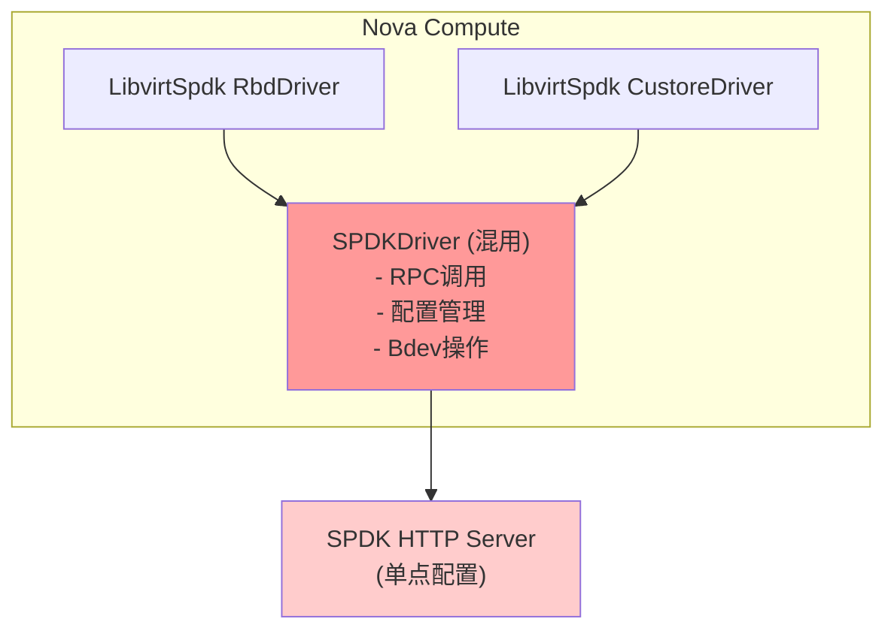

**问题**：
- 配置分散在cinder和libvirt配置组
- RPC调用与业务逻辑耦合
- 不支持多集群配置
- QoS功能缺失

#### 3.1.2 优化后架构

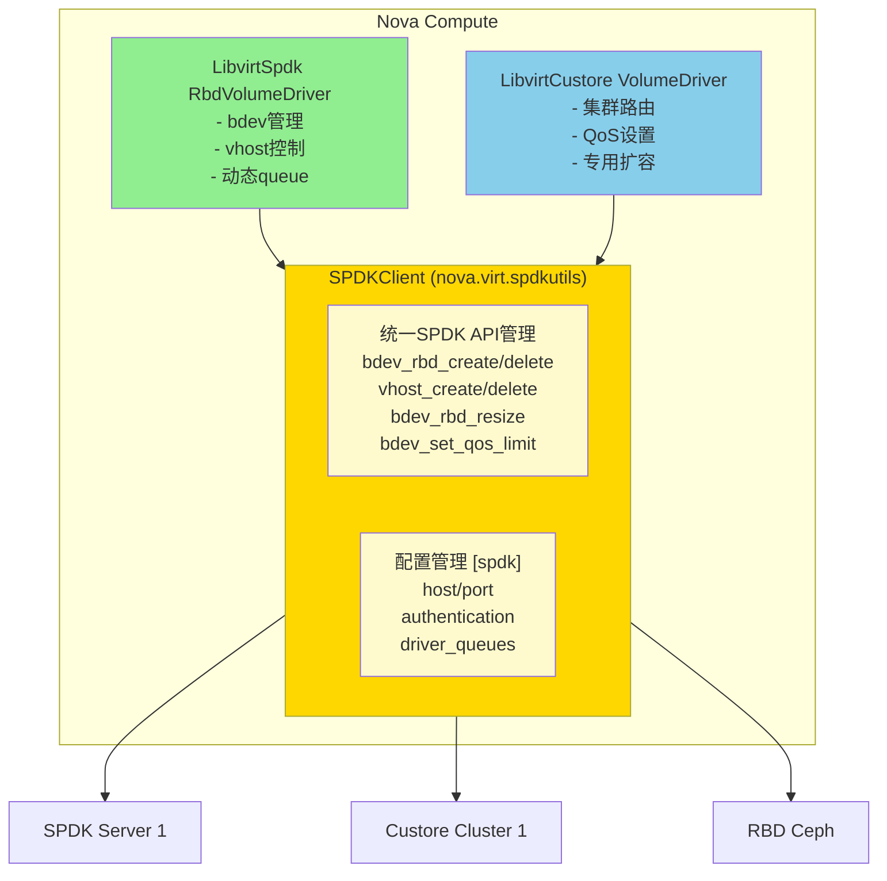

### 3.2 分层架构

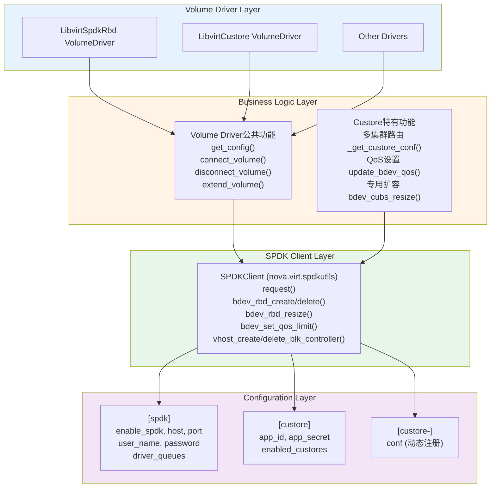

---

## 四、功能详细设计

### 4.1 功能一：多Custore集群支持

#### 4.1.1 设计思路

传统实现只支持单一Custore集群，配置硬编码在`[custore]`节。为支持多集群多租户场景，采用动态配置注册机制：

```
初始化流程:
1. 读取[custore]enabled_custores配置项
2. 为每个集群创建动态配置组[custore-<cluster_id>]
3. 运行时根据volume的custore_cluster_id选择对应配置
```

#### 4.1.2 配置设计

```ini
# nova.conf

[custore]
# 启用的Custore集群列表
enabled_custores = custore-6a2059d1-438c-47e5-80fc-d3bd1ab7fafa,
                   custore-1fac4f49-a57f-4e27-a667-16c010550503

# 默认配置（向后兼容）
app_id = 1
app_secret = custore

[custore-6a2059d1-438c-47e5-80fc-d3bd1ab7fafa]
# 集群1专用配置文件
conf = /etc/nova/custore-cluster1.conf

[custore-1fac4f49-a57f-4e27-a667-16c010550503]
# 集群2专用配置文件
conf = /etc/nova/custore-cluster2.conf
```

#### 4.1.3 核心实现

```python
# nova/conf/custore.py

def register_dynamic_opts(conf):
    """动态注册Custore集群配置"""
    opt = cfg.StrOpt('conf',
                     default='/etc/custore/custore.conf',
                     help='Path to the custore configuration file')
    # 为每个启用的集群注册配置组
    for custore_name in conf.custore.enabled_custores:
        conf.register_opt(opt, group=custore_name)
```

```python
# nova/virt/libvirt/volume/custore.py

def _get_custore_conf(connection_info):
    """根据volume连接信息获取对应集群配置"""
    custore_cluster_id = connection_info.get(
        'data', {}).get('custore_cluster_id')
    if not custore_cluster_id:
        return None
    else:
        group = getattr(CONF, "custore-%s" % custore_cluster_id)
        if group is None:
            return None
        else:
            return group.conf
```

#### 4.1.4 路由逻辑

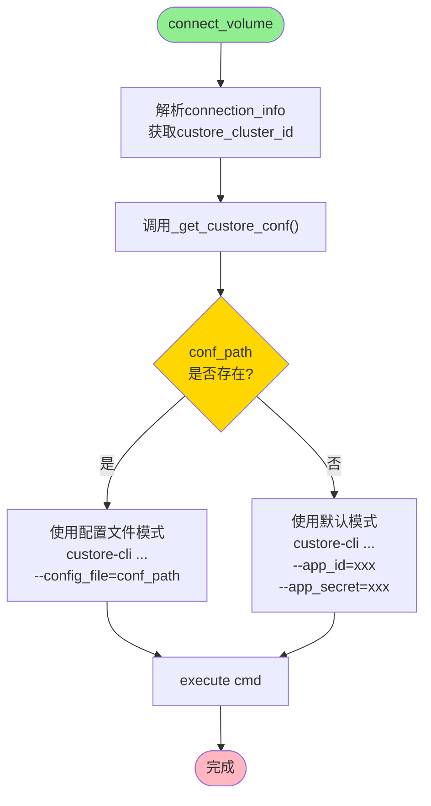

### 4.2 功能二：QoS支持

#### 4.2.1 设计思路

通过SPDK的`bdev_set_qos_limit`接口实现对Custore卷的IOPS限制，确保资源公平分配。

#### 4.2.2 QoS参数

```python
QoS参数结构:
{
    'spdk_bdev_qos': {
        'rw_ios_per_sec': 10000,      # 读写IOPS限制
        'rw_mbytes_per_sec': 1000,    # 读写带宽限制(MB/s)
        'r_mbytes_per_sec': 800,      # 读带宽限制(MB/s)
        'w_mbytes_per_sec': 800,      # 写带宽限制(MB/s)
    }
}
```

#### 4.2.3 实现流程

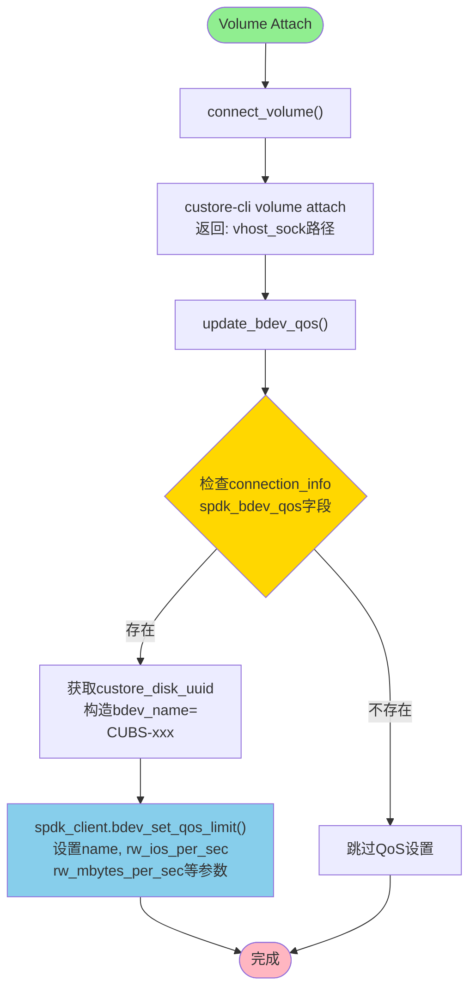

#### 4.2.4 核心代码

```python
# nova/virt/spdkutils.py

def bdev_set_qos_limit(self, bdev_name, qos):
    """设置bdev的QoS限制"""
    params = {"name": bdev_name}
    params.update(qos.get('spdk_bdev_qos', {}))

    payload = {
        "method": "bdev_set_qos_limit",
        "id": 1,
        "params": params,
    }

    result = self.request(payload)
    if "error" not in result:
        return result.get("result")
    else:
        raise exception.SetBdevQosFailed(bdev_name=bdev_name,
                                        reason=ex.message)
```

```python
# nova/virt/libvirt/volume/custore.py

def update_bdev_qos(self, connection_info):
    """更新Custore卷的QoS设置"""
    qos = connection_info.get('data', {}).get('spdk_bdev_qos')
    if not qos:
        return

    custore_disk_id = connection_info.get('data', {}).get(
        'custore_disk_uuid')
    if not custore_disk_id:
        LOG.warning("Can't get custore_disk_uuid, skip QoS update")
        return

    bdev_name = 'CUBS-%s' % custore_disk_id
    self.spdk_driver.bdev_set_qos_limit(bdev_name, qos)
```

### 4.3 功能三：动态Queue数量计算

#### 4.3.1 问题描述

在高版本内核（4.18+）中，当vhost-user-blk的queue数量超过实例vCPU数量时，VM启动会hang住，报错：
```
task systemd-udevd:345 blocked for more than 122 seconds
```

#### 4.3.2 解决方案

动态计算queue数量，取配置值和实例vCPU数量的最小值：

```python
queue_count = min(instance.vcpus, CONF.spdk.driver_queues)
```

#### 4.3.3 实现逻辑

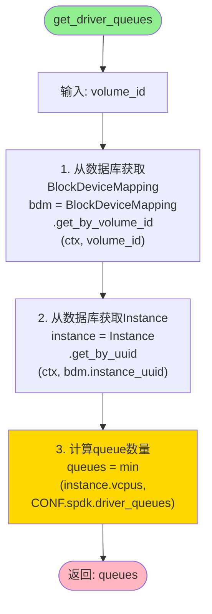

#### 4.3.4 应用场景

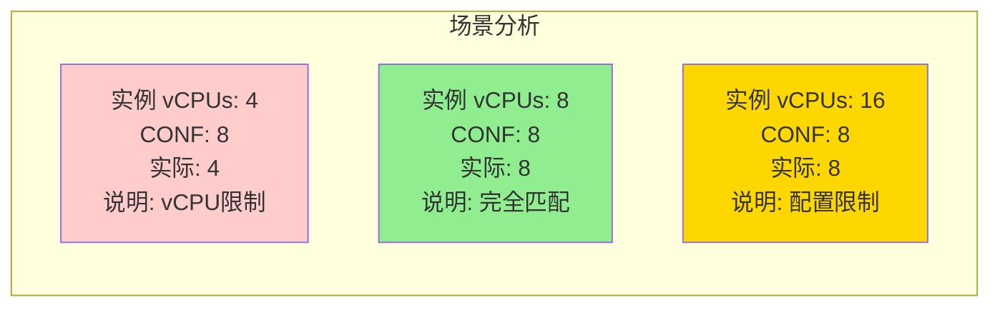

### 4.4 功能四：SPDKClient统一管理

#### 4.4.1 设计思路

将分散在volume driver中的SPDK API调用统一抽取到SPDKClient类中，实现：

1. **关注点分离**：业务逻辑与API调用分离
2. **代码复用**：多个driver共享SPDK操作
3. **统一异常处理**：集中处理SPDK错误
4. **便于测试**：Mock单个接口而非整个driver

#### 4.4.2 API接口设计

```python
class SPDKClient:
    """SPDK HTTP API客户端"""

    # 基础方法
    request(payload)              # 通用HTTP请求

    # RBD Bdev操作
    bdev_rbd_create(connection_info)
    bdev_rbd_delete(volume_id)
    bdev_rbd_resize(volume_id, new_size)

    # Vhost控制器操作
    vhost_create_blk_controller(volume_id)
    vhost_delete_controller(volume_id)

    # QoS操作
    bdev_set_qos_limit(bdev_name, qos)
```

#### 4.4.3 请求/响应格式

```json
// 请求格式
{
    "jsonrpc": "2.0",
    "method": "bdev_rbd_create",
    "id": 1,
    "params": {
        "pool_name": "rbd",
        "rbd_name": "volume-1234",
        "name": "1234",
        "user_id": "cinder",
        "block_size": 512
    }
}

// 成功响应
{
    "jsonrpc": "2.0",
    "id": 1,
    "result": true
}

// 错误响应
{
    "jsonrpc": "2.0",
    "id": 1,
    "error": {
        "code": -32603,
        "message": "spdk_json_decode_object failed"
    }
}
```

#### 4.4.4 HTTP状态码处理

```python
def request(self, payload):
    """统一HTTP请求处理"""
    req = requests.post(url, data=jsonutils.dumps(payload),
                        auth=(user_name, password), verify=False)

    if req.status_code == 200:
        return req.json()
    elif req.status_code == 400:
        raise exc.HTTPNotFound("Wrong JSON syntax")
    elif req.status_code == 401:
        raise exc.HTTPUnauthorized("Missing or incorrect user/password")
    # ...其他状态码处理
```

### 4.5 功能五：Custore专用扩容

#### 4.5.1 设计思路

Custore使用CUBS（Custom Unified Block Store）作为块设备抽象层，扩容时需要使用专用的`bdev_cubs_resize`方法，而非通用的`bdev_rbd_resize`。

#### 4.5.2 Bdev命名规则

```
RBD Bdev:    <volume_id>
CUBS Bdev:   CUBS-<custore_disk_uuid>
```

#### 4.5.3 扩容流程

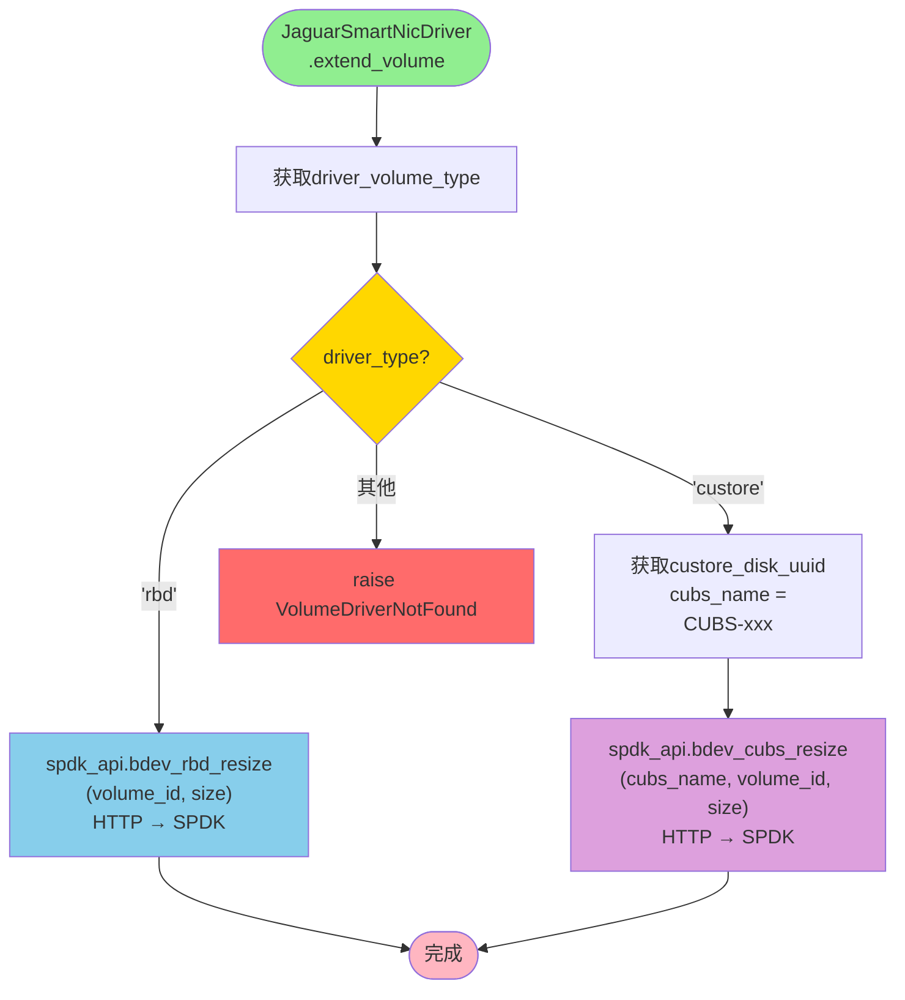

#### 4.5.4 SPDK API调用

```python
# nova/virt/elasticbm/spdk_client.py

def bdev_cubs_resize(self, cubs_name, volume_id, new_size):
    """调整Custore Bdev大小"""
    payload = {
        "method": "bdev_cubs_resize",
        "id": 1,
        "params": {
            "name": cubs_name,
            "new_size": new_size,
        }
    }

    result = self.request(payload)
    if "error" not in result:
        return result.get("result")
    else:
        raise exception.ResizeBdevFailed(dev_name=volume_id,
                                         reason=ex.message)
```

---

## 五、模块设计

### 5.1 模块组织结构

```
nova/
├── conf/
│   ├── __init__.py              # 添加spdk导入
│   ├── cinder.py                # 移除spdk相关配置
│   ├── libvirt.py               # 移除spdk相关配置
│   ├── spdk.py                  # 新增: SPDK配置定义
│   └── custore.py               # 修改: 添加动态配置支持
│
├── exception.py                 # 新增异常类
│   ├── BdevRbdCreateFailed
│   ├── RbdBdevDeleteFailed
│   ├── CreateVhostControllerFailed
│   ├── VhostControllerDeleteFalied
│   ├── ResizeRbdBdevFailed
│   ├── SetBdevQosFailed
│   └── ResizeBdevFailed
│
├── virt/
│   ├── spdkutils.py             # 新增: SPDKClient实现
│   ├── libvirt/
│   │   ├── config.py            # 修改: vhost_reconnect_timeout来源
│   │   ├── driver.py            # 修改: enable_spdk路由逻辑
│   │   └── volume/
│   │       ├── spdk.py          # 重构: 使用SPDKClient
│   │       ├── custore.py       # 新增: 独立Custore驱动
│   │       └── local_volume.py  # 修改: 异常格式
│   └── elasticbm/
│       ├── jaguar.py            # 修改: Custore扩容支持
│       └── spdk_client.py       # 修改: 添加bdev_cubs_resize
│
└── tests/unit/virt/
    ├── test_spdkutils.py        # 新增: SPDKClient测试
    └── libvirt/volume/
        ├── test_spdk.py         # 新增: SPDK driver测试
        └── test_custore.py      # 新增: Custore driver测试
```

### 5.2 类设计

#### 5.2.1 SPDKClient类

```python
# nova/virt/spdkutils.py

class SPDKClient:
    """SPDK HTTP API客户端类

    职责:
    - 封装所有SPDK JSON-RPC API调用
    - 处理HTTP认证和连接
    - 统一异常处理和转换
    """

    def __init__(self):
        # 从配置初始化连接参数
        self.user_name = CONF.spdk.user_name
        self.password = CONF.spdk.password
        self.host = CONF.spdk.host
        self.port = CONF.spdk.port

    # ========== 公共API ==========

    def request(self, payload):
        """发送JSON-RPC请求到SPDK服务器"""
        pass

    def bdev_rbd_create(self, connection_info):
        """创建RBD块设备

        Args:
            connection_info: 包含RBD连接信息的字典

        Raises:
            BdevRbdCreateFailed: 创建失败
        """
        pass

    def bdev_rbd_delete(self, volume_id):
        """删除RBD块设备

        Args:
            volume_id: 卷UUID

        Returns:
            bool: 删除成功返回True

        Raises:
            RbdBdevDeleteFailed: 删除失败
        """
        pass

    def bdev_rbd_resize(self, volume_id, new_size):
        """调整RBD块设备大小

        Args:
            volume_id: 卷UUID
            new_size: 新大小(MiB)

        Raises:
            ResizeRbdBdevFailed: 调整大小失败
        """
        pass

    def bdev_set_qos_limit(self, bdev_name, qos):
        """设置块设备QoS限制

        Args:
            bdev_name: 块设备名称
            qos: QoS参数字典

        Raises:
            SetBdevQosFailed: 设置QoS失败
        """
        pass

    def vhost_create_blk_controller(self, volume_id):
        """创建vhost块控制器

        Args:
            volume_id: 卷UUID

        Returns:
            bool: 创建成功返回True

        Raises:
            CreateVhostControllerFailed: 创建失败
        """
        pass

    def vhost_delete_controller(self, volume_id):
        """删除vhost块控制器

        Args:
            volume_id: 卷UUID

        Returns:
            bool: 删除成功返回True

        Raises:
            VhostControllerDeleteFalied: 删除失败
        """
        pass
```

#### 5.2.2 LibvirtCustoreVolumeDriver类

```python
# nova/virt/libvirt/volume/custore.py

class LibvirtCustoreVolumeDriver(LibvirtBaseVolumeDriver):
    """Custore卷驱动

    职责:
    - 管理Custore卷的生命周期
    - 支持多Custore集群
    - 实现QoS设置
    - 提供扩容能力
    """

    def __init__(self, host):
        super().__init__(host, is_block_dev=False)
        self.spdk_driver = spdkutils.SPDKClient()

    def get_config(self, connection_info, disk_info):
        """生成Libvirt XML配置

        生成的XML格式:
        <disk type='vhostuser' device='disk'>
          <driver name='qemu' type='raw' queues='8'/>
          <source type='unix' path='/var/lib/nova/tmp/vhost.xxx'>
            <reconnect enabled='yes' timeout='3'/>
          </source>
        </disk>
        """
        pass

    def connect_volume(self, connection_info, instance):
        """连接Custore卷

        流程:
        1. 根据cluster_id获取配置
        2. 调用custore-cli attach
        3. 更新QoS设置(如果配置了)
        """
        pass

    def disconnect_volume(self, connection_info, instance):
        """断开Custore卷"""
        pass

    def extend_volume(self, connection_info, instance, requested_size):
        """扩容Custore卷"""
        pass

    def update_bdev_qos(self, connection_info):
        """更新Custore卷的QoS设置"""
        pass
```

#### 5.2.3 LibvirtSpdkRbdVolumeDriver类

```python
# nova/virt/libvirt/volume/spdk.py

class LibvirtSpdkRbdVolumeDriver(LibvirtBaseVolumeDriver):
    """SPDK RBD卷驱动

    职责:
    - 通过SPDK访问RBD卷
    - 管理vhost-user控制器
    - 动态计算queue数量
    """

    def __init__(self, host):
        super().__init__(host, is_block_dev=False)
        self.spdk_driver = spdkutils.SPDKClient()

    def get_config(self, connection_info, disk_info):
        """生成Libvirt XML配置，使用动态queue数量"""
        pass

    def connect_volume(self, connection_info, instance):
        """连接RBD卷

        流程:
        1. 创建RBD bdev
        2. 创建vhost块控制器
        """
        pass

    def disconnect_volume(self, connection_info, instance):
        """断开RBD卷

        流程:
        1. 删除vhost控制器
        2. 删除RBD bdev
        """
        pass

    def extend_volume(self, connection_info, instance, requested_size):
        """扩容RBD卷"""
        pass
```

---

## 六、数据流设计

### 6.1 卷挂载流程

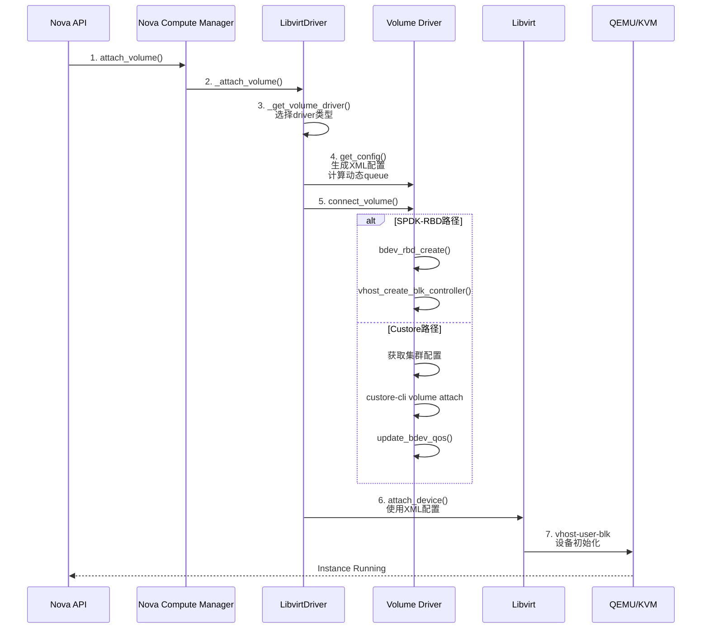

### 6.2 QoS设置流程

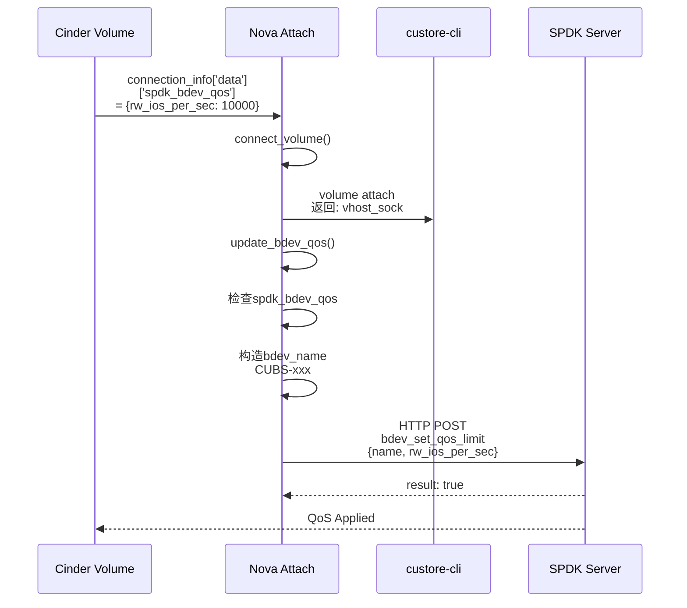

### 6.3 扩容流程

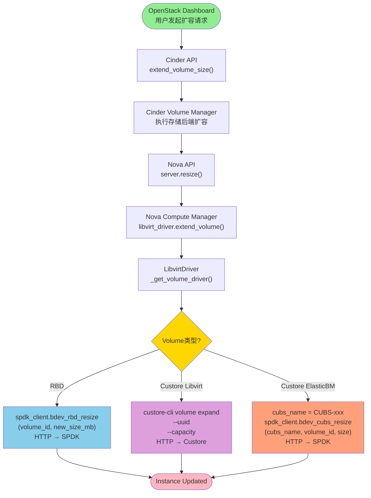

---

## 七、配置设计

### 7.1 配置项汇总

```
┌─────────────────────────────────────────────────────────────────────────┐
│                            配置项分组                                    │
├─────────────────────────────────────────────────────────────────────────┤
│ 组名              │ 配置项              │ 默认值     │ 说明            │
├─────────────────────────────────────────────────────────────────────────┤
│ [spdk]           │                      │            │                 │
│                  │ enable_spdk         │ False      │ 启用SPDK-RBD    │
│                  │ host                │ $my_ip     │ SPDK服务器地址  │
│                  │ port                │ 8000       │ SPDK服务器端口  │
│                  │ user_name           │ None       │ 认证用户名      │
│                  │ password            │ None       │ 认证密码        │
│                  │ vhost_reconnect_    │ 3          │ vhost重连超时   │
│                  │   timeout           │            │ (秒)            │
│                  │ bdev_block_size     │ 512        │ 块大小(字节)    │
│                  │ driver_queues       │ 8          │ vhost队列数量   │
│                  │ controller_path     │            │                 │
│                  │                     │            │ vhost socket    │
│                  │                     │            │ 路径             │
├─────────────────────────────────────────────────────────────────────────┤
│ [custore]        │                      │            │                 │
│                  │ app_id              │ 1          │ 默认应用ID      │
│                  │ app_secret          │ custore    │ 默认应用密钥    │
│                  │ enabled_custores    │ []         │ 启用的集群列表  │
├─────────────────────────────────────────────────────────────────────────┤
│ [custore-<id>]   │ conf                │            │ 集群配置文件路径 │
│                  │ (动态注册)          │            │                 │
└─────────────────────────────────────────────────────────────────────────┘
```

### 7.2 配置示例

```ini
# nova.conf - SPDK配置示例

[spdk]
# SPDK功能开关
enable_spdk = true

# SPDK服务器连接配置
host = 192.168.1.100
port = 8000
user_name = admin
password = secure_password

# Vhost配置
vhost_reconnect_timeout = 3
driver_queues = 8
controller_path = /var/lib/nova/tmp

# Bdev配置
bdev_block_size = 512

[custore]
# 默认Custore配置
app_id = 1
app_secret = default_secret

# 多集群配置
enabled_custores = custore-prod-01,
                   custore-prod-02,
                   custore-test-01

[custore-prod-01]
conf = /etc/nova/custore-prod-01.conf

[custore-prod-02]
conf = /etc/nova/custore-prod-02.conf

[custore-test-01]
conf = /etc/nova/custore-test-01.conf
```

### 7.3 动态配置注册

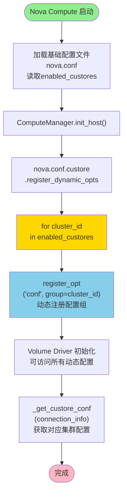

---

## 八、异常处理设计

### 8.1 异常类层次结构

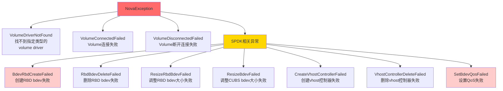

### 8.2 异常处理策略

#### 8.2.1 HTTP状态码处理

```python
def request(self, payload):
    try:
        req = requests.post(url, data=jsonutils.dumps(payload), ...)

        if req.status_code == 200:
            return req.json()
        elif req.status_code == 400:
            raise exc.HTTPNotFound("Wrong JSON syntax")
        elif req.status_code == 401:
            raise exc.HTTPUnauthorized("Missing or incorrect user/password")
        else:
            raise Exception(f"Unexpected status code: {req.status_code}")

    except requests.exceptions.Timeout:
        raise Exception("SPDK server timeout")
    except requests.exceptions.ConnectionError:
        raise Exception("Cannot connect to SPDK server")
```

#### 8.2.2 SPDK错误响应处理

```python
def bdev_rbd_create(self, connection_info):
    try:
        result = self.request(payload)

        if "error" not in result:
            return result.get("result")
        else:
            # 解析SPDK错误
            error = result.get("error", {})
            code = error.get("code")
            message = error.get("message")

            # 根据错误类型进行不同处理
            if "No such file" in message:
                # 可能是配置问题
                LOG.error("RBD configuration error: %s", message)
            elif "Permission denied" in message:
                # Ceph认证问题
                LOG.error("Ceph authentication failed: %s", message)

            raise Exception(jsonutils.dumps(error))

    except Exception as ex:
        # 转换为Nova异常
        raise exception.BdevRbdCreateFailed(
            volume_id=volume_id,
            reason=ex.message
        )
```

#### 8.2.3 优雅降级处理

```python
def update_bdev_qos(self, connection_info):
    """更新QoS，失败不影响volume attach"""
    qos = connection_info.get('data', {}).get('spdk_bdev_qos')
    if not qos:
        return

    custore_disk_id = connection_info.get('data', {}).get('custore_disk_uuid')
    if not custore_disk_id:
        LOG.warning("Cannot get custore_disk_uuid, skip QoS update")
        return  # 跳过QoS设置，不中断流程

    try:
        bdev_name = 'CUBS-%s' % custore_disk_id
        self.spdk_driver.bdev_set_qos_limit(bdev_name, qos)
    except exception.SetBdevQosFailed:
        LOG.warning("Failed to set QoS for volume %s, but continue",
                    connection_info.get('volume_id'))
        # QoS设置失败不中断volume attach流程
```

### 8.3 错误恢复机制

#### 8.3.1 连接失败重试

```python
@retry(retry_on_exception=RetryIfConnectionError,
       stop_max_attempt_number=3,
       wait_exponential_multiplier=1000,
       wait_exponential_max=10000)
def _connect_with_retry(self, volume_id):
    """带重试的连接操作"""
    return self._do_connect(volume_id)
```

#### 8.3.2 幂等性保证

```python
def bdev_rbd_delete(self, volume_id):
    """删除bdev，保证幂等性"""
    result = self.request(payload)

    if "error" not in result:
        return result.get("result")
    else:
        message = result.get('error', {}).get('message')
        # 如果设备已不存在，视为成功
        if "No such device" == message:
            LOG.warning("The rbd bdev %s has already been deleted.", volume_id)
            return True  # 幂等返回
        else:
            raise exception.RbdBdevDeleteFailed(...)
```

---

## 附录

### A. 相关文档

- [SPDK官方文档](https://spdk.io/doc/)
- [Libvirt vhost-user配置指南](https://libvirt.org/drvqemu.html#vhostuser)

### B. 术语表

| 术语 | 全称 | 说明 |
|------|------|------|
| SPDK | Storage Performance Development Kit | Intel开源的用户态存储驱动框架 |
| CUBS | Custom Unified Block Store | Custore的块设备抽象层 |
| QoS | Quality of Service | 服务质量，用于资源限制 |
| RBD | RADOS Block Device | Ceph的块设备 |
| vhost-user | - | QEMU与用户态进程的高效通信机制 |
